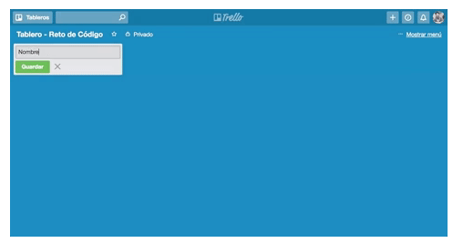

# **Reto Trello**
-----

### **Objetivo**

Replicar el tablero de Trello.

### **Contenido**

La réplica contiene ciertas funcionalidades especificadas en cada versión:

***Versión 0.0.1:***  

- Muestra el texto "Add a list ...".

- Al hacer click se oculta el texto y muestra un formulario.

- El formulario está conformado por un input, un botón que añade tareas a tu lista y un botón para cerrar el formulario.

***Versión 0.0.2***

- Al dar click en el botón "Save", se muestra un nuevo cuadro donde aparece el nombre de la lista agregada.

- Muestra un texto "Add a card" dentro de la lista.

***Versión 0.0.3***

- Al dar click en "Add a card...", muestra un formulario con un textarea, un botón "Add" y un botón que cierra el formulario.

***Versión 0.0.4***

- Nótese el focus del input al dar click en "Add a card..."

- Al dar click en el botón "Add", aparece el texto de la tarea debajo del título de la lista.

***Versión 0.0.5***

- Muestra el formulario nuevamente debajo de la última tarea añadida.

***_Resultado:_*** 

